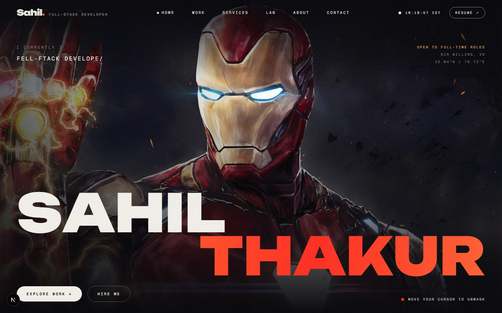
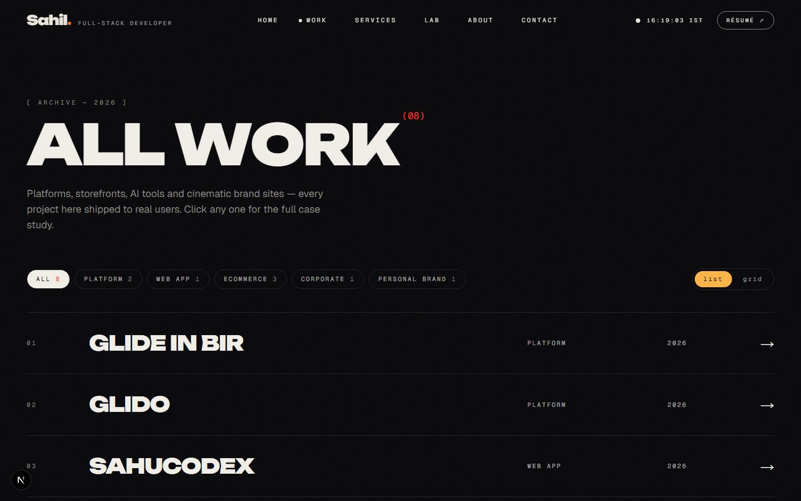
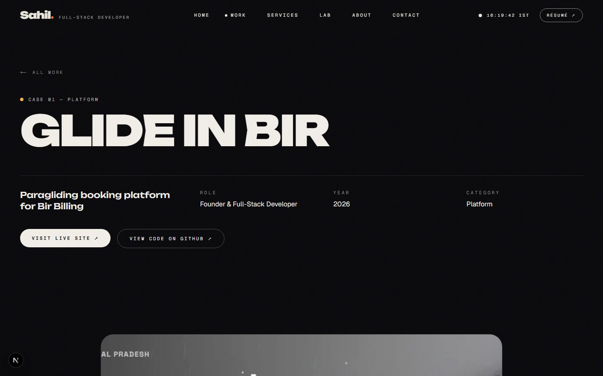
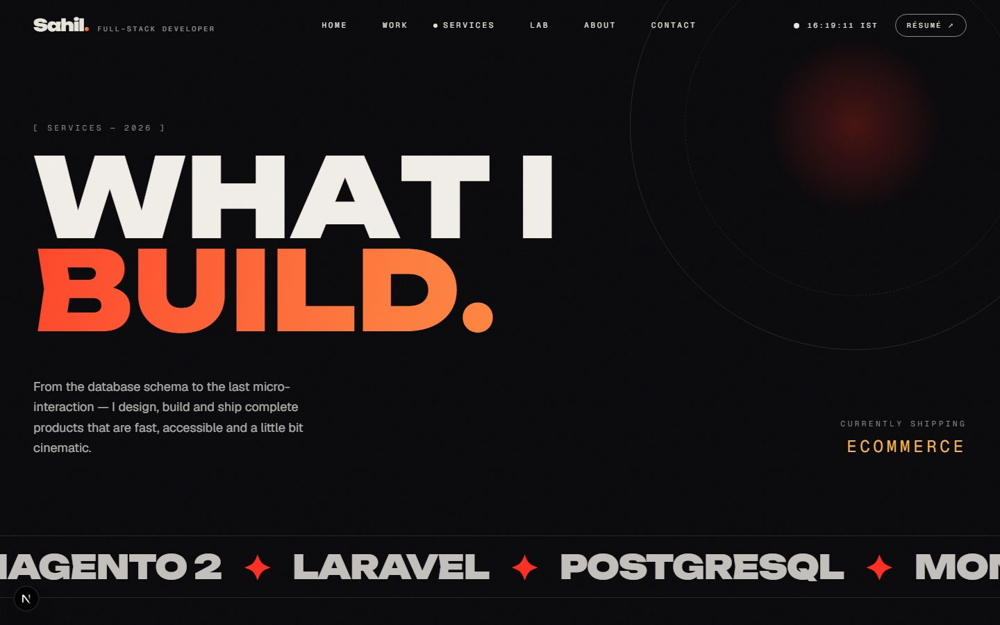
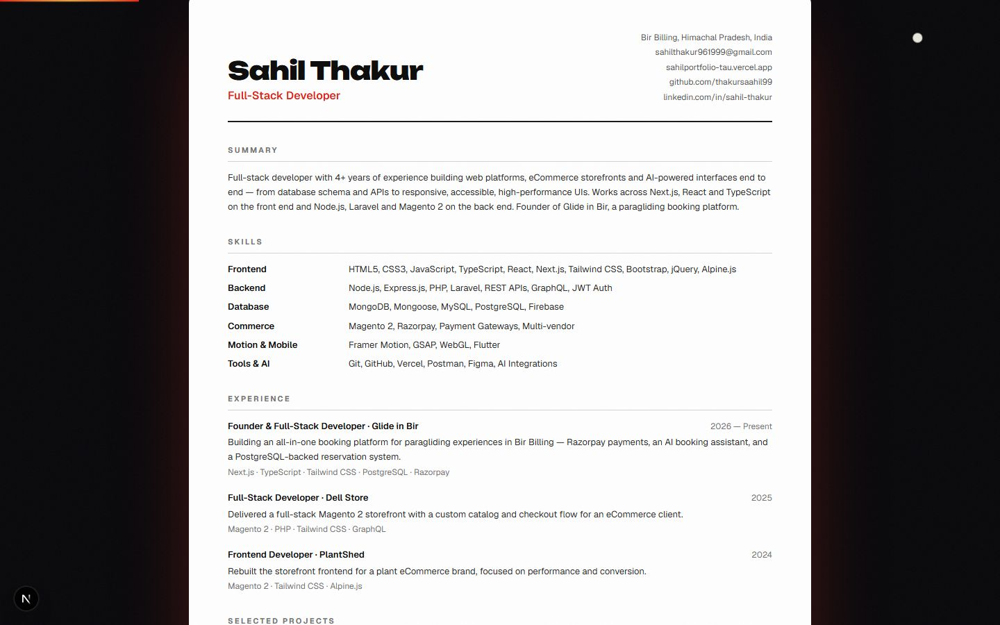
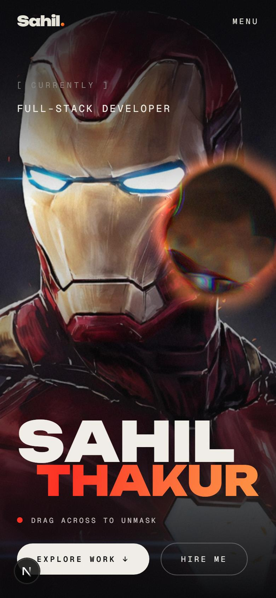

# Sahil Thakur — Portfolio

Personal portfolio of **Sahil Thakur**, a full-stack developer from Bir Billing, India. It covers platforms, eCommerce storefronts and AI-powered interfaces, and the site itself shows the kind of motion-rich, performance-aware frontend work I do.

**Live:** https://sahilportfolio-tau.vercel.app · **Résumé:** https://sahilportfolio-tau.vercel.app/resume



## Highlights

- **WebGL "x-ray" hero.** A custom GLSL shader blends two images through a metaball lens that follows the cursor (or drifts on its own on touch screens). It has an adaptive render resolution that steps down when a device can't hold its frame rate, and per-pixel work is skipped wherever the lens isn't.
- **Intro on every navigation.** The page transitions are a small intro of their own: curtains close, a multilingual greeting flickers, the page title rises with a progress counter, and a molten seam opens the curtains. They also play on browser back/forward.
- **Data-driven content.** Projects, experience, skills and the résumé all render from typed data in `src/data`, so one edit updates the home page, case studies, About timeline and printable résumé together. Skill cards count real usage across shipped projects instead of showing self-rated percentages.
- **Printable résumé.** `/resume` is an ATS-friendly page that prints to a single A4 PDF, with print-only styles.
- **Runs on low-power devices.** Low-power devices are detected from CPU cores and memory, and confirmed by measuring frame drops during the intro. They get a "lite" mode that keeps the look and drops the decorative per-frame work (animated grain, shimmer, drifting blurs, backdrop blur). Large blur filters were replaced with radial gradients throughout.
- **Accessible.** The site has a skip-to-content link, visible keyboard focus, "Skip intro" (or <kbd>Esc</kbd>), full `prefers-reduced-motion` support, alt text and semantic landmarks.
- **SEO-ready.** Per-page metadata, a generated Open Graph card, `sitemap.xml`, `robots.txt` and JSON-LD `Person` structured data are all built in.

| Work index | Case study |
| --- | --- |
|  |  |
| **Services** | **Résumé** |
|  |  |

<p align="center"></p>

## Tech stack

| Area | Tools |
| --- | --- |
| Framework | Next.js 16 (App Router), React 19, TypeScript |
| Styling | Tailwind CSS 4 |
| Motion | Framer Motion, GSAP ScrollTrigger, Lenis smooth scroll |
| Graphics | Raw WebGL + GLSL (no 3D library), Canvas 2D |
| Platform | Vercel (hosting, Analytics), `next/og` for social cards |

## Pages

| Route | What's there |
| --- | --- |
| `/` | WebGL hero, about teaser, stacking service cards, project carousel, contact section |
| `/work` | Filterable project index with a cursor-following preview |
| `/work/[slug]` | Case studies with brief → approach → result, features, stack and a draggable gallery |
| `/services` | Services, a scroll-driven horizontal process, deliverables and FAQ |
| `/lab` | Interactive motion experiments: repulsor dot field, text decoder, drag physics, scroll type |
| `/about` | Story, base camp, skills with real project counts, career timeline, principles |
| `/resume` | One-page printable résumé |
| `/contact` | Contact page |

## Project structure

```
src/
  app/            routes, metadata, sitemap, robots, OG image
  components/     sections and page components
    fx/           reusable effects (WebGL reveal, reveal text, magnetic, marquee…)
    transition/   intro-style page transitions
  data/           profile, projects, navigation — the single source of content
  lib/            perf tier detection, smooth scroll, site URL, hooks
```

## Running locally

```bash
npm install
npm run dev      # http://localhost:3000
npm run build    # production build
npm run lint
```

Set `NEXT_PUBLIC_SITE_URL` when deploying to a custom domain, so canonical URLs, the sitemap and social cards point at it.

## Contact

**Email:** sahilthakur961999@gmail.com · **GitHub:** [@thakursaahil99](https://github.com/thakursaahil99)
